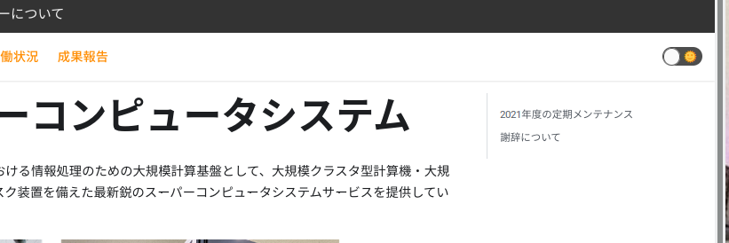

## ダークモード切り替えボタンの削除




以下のように`themeconfig: { colorMode: disableSwitch: true}`の部分を追加すると切り替えボタンが表示されなくなる。

```javascript
module.exports = {
  title: 'My Site',
  tagline: 'Dinosaurs are cool',
  url: 'https://your-docusaurus-test-site.com',
  baseUrl: '/',
  onBrokenLinks: 'throw',
  onBrokenMarkdownLinks: 'warn',
  favicon: 'img/favicon.ico',
  organizationName: 'facebook', // Usually your GitHub org/user name.
  projectName: 'docusaurus', // Usually your repo name.
    themeConfig: {
        colorMode: {
            disableSwitch: true,
        },
    navbar: {
      title: 'NIG Supercomputer',
      logo: {

```


## Last Updateの表示、EditThisPageの非表示


- 以下の`showLastUpdateTime`の部分により、Last Updateが各ページに表示されるようになる。
- 以下の`editUrl`をコメントアウトすることにより、EditThisPageが非表示となる。


```javascript
  presets: [
    [
      '@docusaurus/preset-classic',
      {
        docs: {
            sidebarPath: require.resolve('./sidebars.js'),
            showLastUpdateTime: true,
            routeBasePath: '/',
          // Please change this to your repo.
          // editUrl: 'https://github.com/facebook/docusaurus/edit/main/website/',
        },

```

