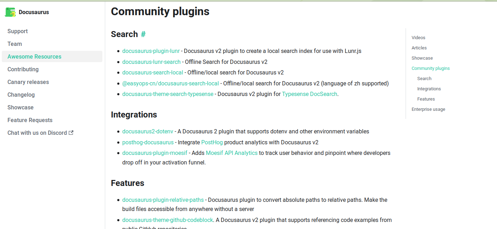

Docusaurusのpluginを見ると、以下の全文検索プラグインがあった。

- https://docusaurus.io/community/resources#search




これらのうちの、上から二番目を使うこととした。

- https://github.com/lelouch77/docusaurus-lunr-search


githubリポジトリのREAMEに書いてあるとおり、`npm i docusaurus-lunr-search --save`した。

しかし以下のようなエラーが出た。

```
oogasawa@vivobook:~/works/sau_Research00 (2021-10-15 01:01:51)
$ npm i docusaurus-lunr-search --save

npm ERR! code ERESOLVE
npm ERR! ERESOLVE unable to resolve dependency tree
npm ERR! 
npm ERR! While resolving: sau-research-00@0.0.0
npm ERR! Found: react@17.0.2
npm ERR! node_modules/react
npm ERR!   react@"^17.0.1" from the root project
npm ERR!   peer react@"^16.8.4 || ^17.0.0" from @docusaurus/core@2.0.0-beta.6
npm ERR!   node_modules/@docusaurus/core
npm ERR!     @docusaurus/core@"2.0.0-beta.6" from the root project
npm ERR!     peer @docusaurus/core@"^2.0.0-alpha.60 || ^2.0.0" from docusaurus-lunr-search@2.1.14
npm ERR!     node_modules/docusaurus-lunr-search
npm ERR!       docusaurus-lunr-search@"*" from the root project
npm ERR!   1 more (react-dom)
npm ERR! 
npm ERR! Could not resolve dependency:
npm ERR! peer react@"^16.8.4" from docusaurus-lunr-search@2.1.14
npm ERR! node_modules/docusaurus-lunr-search
npm ERR!   docusaurus-lunr-search@"*" from the root project
npm ERR! 
npm ERR! Fix the upstream dependency conflict, or retry
npm ERR! this command with --force, or --legacy-peer-deps
npm ERR! to accept an incorrect (and potentially broken) dependency resolution.
npm ERR! 
npm ERR! See /home/oogasawa/.npm/eresolve-report.txt for a full report.

npm ERR! A complete log of this run can be found in:
npm ERR!     /home/oogasawa/.npm/_logs/2021-10-14T16_02_08_516Z-debug.log
```


`package.json`を見てみると、`npm install`には失敗しているようで、
`docusaurus-lunr-search`に関する記載が追記されていなかった。


```json
  "dependencies": {
    "@docusaurus/core": "2.0.0-beta.6",
    "@docusaurus/preset-classic": "2.0.0-beta.6",
    "@mdx-js/react": "^1.6.21",
    "@svgr/webpack": "^5.5.0",
    "clsx": "^1.1.1",
    "file-loader": "^6.2.0",
    "prism-react-renderer": "^1.2.1",
    "react": "^17.0.1",
    "react-dom": "^17.0.1",
    "url-loader": "^4.1.1"
  },

```


しかし遺伝研スパコンホームページはこれでうまく行っていたので、遺伝研スパコンホームページの`package.json`を見てみる。

```json
  "dependencies": {
    "@docusaurus/core": "2.0.0-beta.5",
    "@docusaurus/preset-classic": "2.0.0-beta.5",
    "@mdx-js/react": "^1.6.21",
    "@svgr/webpack": "^5.5.0",
    "clsx": "^1.1.1",
    "docusaurus-lunr-search": "^2.1.14",
    "file-loader": "^6.2.0",
    "prism-react-renderer": "^1.2.1",
    "react": "^17.0.1",
    "react-dom": "^17.0.1",
    "url-loader": "^4.1.1"
  },

```

こちらはlunr-searchの記載が追記されていた。
違っているのは、`@docusaurus/core`などのバージョンだけであった。

- しかし`@docusaurus/core`などのバージョンを"2.0.0-beta.5"にしても相変わらず
  `docusaurus-lunr-search`のインストール時に同じエラーとなった。
- エラーメッセージを参考に以下のように`react`, `react-dom`のバージョンを`"^16.8.4"`としたところエラーは出なくなった。


```json
  "dependencies": {
    "@docusaurus/core": "2.0.0-beta.6",
    "@docusaurus/preset-classic": "2.0.0-beta.6",
    "@mdx-js/react": "^1.6.21",
    "@svgr/webpack": "^5.5.0",
    "clsx": "^1.1.1",
    "docusaurus-lunr-search": "^2.1.14",
    "file-loader": "^6.2.0",
    "prism-react-renderer": "^1.2.1",
    "react": "^16.8.4",
    "react-dom": "^16.8.4",
    "url-loader": "^4.1.1"
  },

```

結局、reactのバージョン17.0.2が出たのがエラーの原因らしい。
