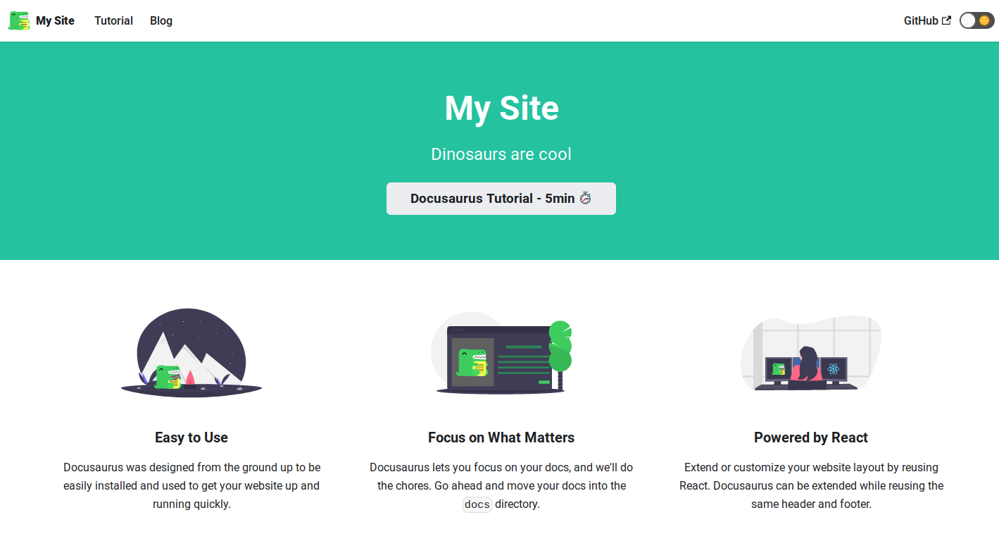
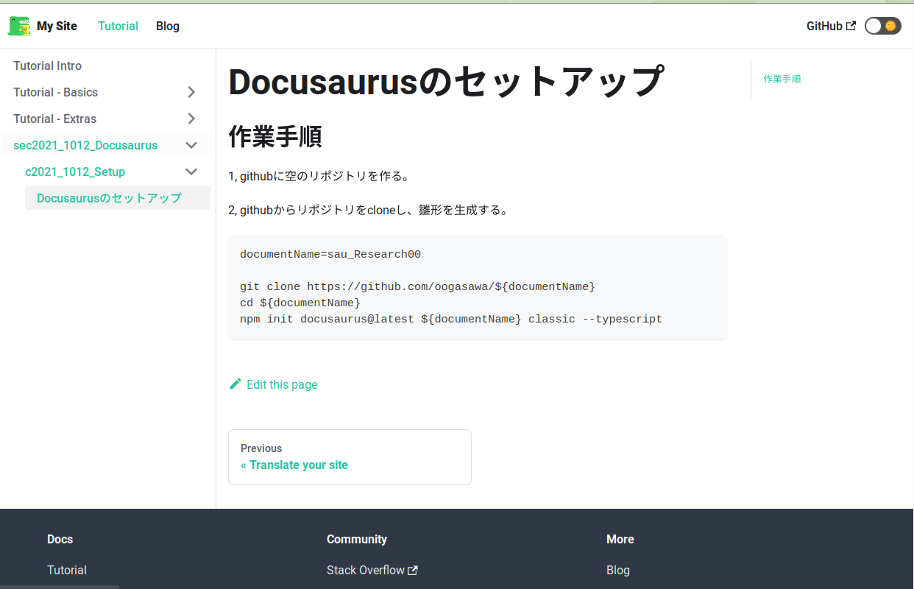

## 作業手順

1, githubに空のリポジトリを作る。

2, githubからリポジトリをcloneし、雛形を生成する。

```
documentName=sau_Research00

git clone https://github.com/oogasawa/${documentName}
cd ${documentName}
npm init docusaurus@latest ${documentName} classic --typescript
```

## 動作確認

起動(`npm start`)するとこのような画面になった。

### トップページ




### Markdownで作成したページの表示

Tutorialをクリックすると以下が表示された。
(`docs/` ディレクトリの下にディレクトリを作成しMarkdownファイルをいくつか作成した。)




## 次にやるべきこと

1. 最初に表示されるページをMarkdownのページにすること。(Docs-only mode)
2. メニューの編集
    - 左メニュー(`sidebars.js`)の編集
    - navbarの編集
3. その他の細かな設定 (`docsaurus.config.js`の調整)
    - ダークモード切り替えボタンの削除
    - LastUpdate, EditThisPageの調整
    - サイト名変更(現在My Siteになってる)
    - Githubへのリンクボタンの削除
4. 全文検索
5. 日英表示 (i18n)
5. 右メニューの非表示


## 参考資料

- 公式ドキュメントの"Installation"のページ
    - https://docusaurus.io/docs/installation
